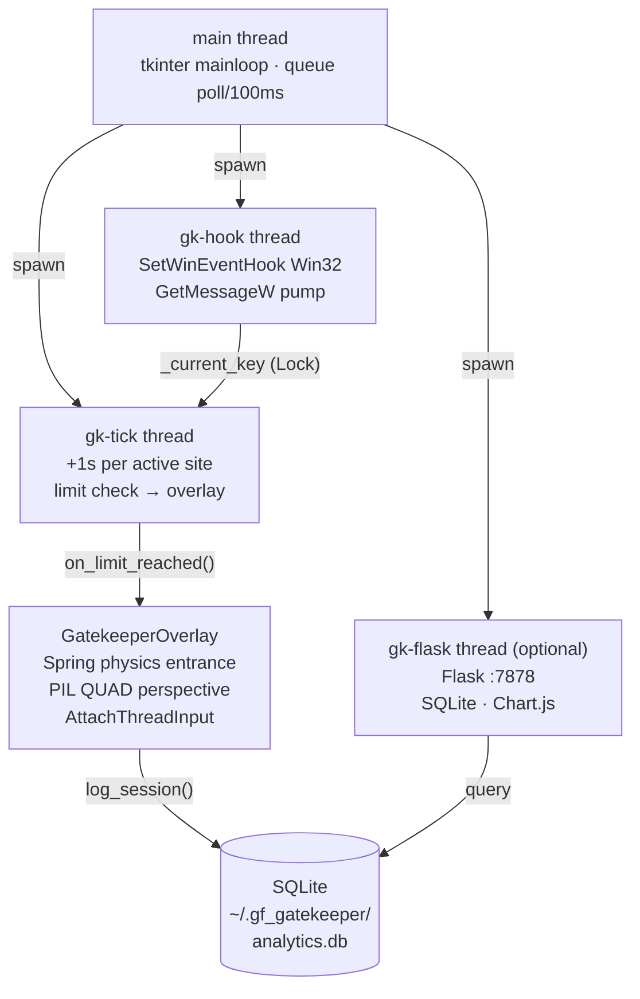

<div align="center">

# 💕 Girlfriend Gatekeeper

**A focus enforcer that shows your girlfriend's face when you've been doom-scrolling too long.**

*Because nothing breaks the infinite scroll quite like love.*

[中文说明](README.zh-CN.md) | English

---

[](https://python.org)
[](https://github.com/Beltran12138/gf-gatekeeper-desktop)
[](LICENSE)
[](https://github.com/Beltran12138/gf-gatekeeper-desktop/stargazers)
[](tests/)

</div>

---

## Demo

### 🖥️ Desktop App (Windows)


### 🌐 Chrome Extension


---

## What it does

You set a per-site time limit (default: 15 min). When you exceed it:

1. A **full-screen overlay** springs onto your display with a 3D entrance animation
2. Your girlfriend's photo, GIF, or video plays with a pulsing glow ring and countdown arc
3. **Click her photo** → WeChat foregrounds instantly (cross-process focus via `AttachThreadInput`)
4. Break ends → overlay vanishes, timer resets

Inspired by [catgatekeeper.org](https://www.catgatekeeper.org/) — built for people whose motivation is slightly more personal than a cat.

---

## Features

**Desktop App (Windows)**

| Feature | Implementation |
|---------|---------------|
| 🎯 **Zero-overhead monitoring** | `SetWinEventHook` Win32 event API — fires on focus change, no polling |
| 📸 **Rich media support** | Photo / GIF / MP4 / AVI — circle-mask or WeChat video-call framing |
| 🌀 **3D entrance animation** | Spring-damped physics (ω=10, ζ=0.6) + PIL QUAD perspective transform |
| 💬 **Click-to-chat** | `AttachThreadInput` + `AllowSetForegroundWindow` cross-process window focus |
| 🎵 **Audio** | pygame.mixer BGM + ffmpeg video audio extraction |
| 📊 **Analytics dashboard** | Embedded Flask + SQLite + Chart.js · real-time + 7-day history |
| 📦 **Portable .exe** | PyInstaller single-file — no Python required for end users |
| ✅ **Tested** | 14 pytest cases — tracker logic + SQLite layer |

**Chrome Extension (cross-platform)**

| Feature | Implementation |
|---------|---------------|
| 📱 **WeChat video-call UI** | Full-screen media + gradient vignette + top bar + action row · Shadow DOM isolation |
| 🎬 **Video / Photo / GIF** | Stored as data URL in `chrome.storage.local` · accessible from popup & content script |
| 🎵 **BGM** | Separate audio upload; suppressed when video has its own audio track |
| 🔇 **Mute toggle** | Mutes overlay media + all page `<video>/<audio>` elements; restores on dismiss |
| ⏱️ **MV3-safe timer** | `chrome.storage.session` survives service-worker sleep · `chrome.alarms` 1-min tick |
| 🔄 **Auto re-inject** | Orphaned content scripts after extension update are detected and replaced automatically |

---

## Quick Start

```bash
# 1. Clone
git clone https://github.com/Beltran12138/gf-gatekeeper-desktop
cd gf-gatekeeper-desktop

# 2. Install
pip install -r requirements.txt
pip install opencv-python  # optional: video (MP4/AVI) support

# 3. Run
python main.py
```

**Setup (30 seconds):**
1. Click **設置** → upload girlfriend's photo / GIF / video
2. Set time limit (default: 15 min per site)
3. Minimize — monitoring starts immediately
4. Open **面板** → analytics at `http://localhost:7878`

> Requires Windows 10/11 · Python 3.11+

### Chrome Extension

1. Open `chrome://extensions` → enable **Developer mode**
2. Click **Load unpacked** → select the `chrome-extension/` folder
3. Click the extension icon → upload girlfriend's photo / GIF / video
4. Set time limit → **Save** → browse social media as usual

> Works on any OS with Chrome · no Python required

---

## Architecture



**Thread safety:** all `_site_time` / `_break_end` / `_current_key` under a single `threading.Lock()`. SQLite writes happen outside the lock.

---

## Technical Highlights

### 1 — Event-Driven Window Tracking

Uses `SetWinEventHook(EVENT_SYSTEM_FOREGROUND)` instead of polling — fires on every foreground window change with near-zero CPU overhead. Parallel tick thread polls `GetForegroundWindow` every second to catch in-browser tab switches (which don't generate window-level events).

```python
hook = user32.SetWinEventHook(
    EVENT_SYSTEM_FOREGROUND, EVENT_SYSTEM_FOREGROUND,
    None, hook_proc, 0, 0,
    WINEVENT_OUTOFCONTEXT | WINEVENT_SKIPOWNPROCESS,
)
```

### 2 — Spring-Damped 3D Entrance

Underdamped spring (overshoots ~8%, settles by t≈0.8s) combined with PIL QUAD perspective simulating top-toward-viewer tilt:

```
x(t) = 1 - e^(-ζωt) · [cos(ωd·t) + (ζω/ωd)·sin(ωd·t)]
ω = 10,  ζ = 0.6,  ωd = ω√(1-ζ²) ≈ 8
```

```python
shrink = int(width * tilt * 0.28)
data = (0, 0,  shrink, h,  w-shrink, h,  w, 0)   # QUAD: TL BL BR TR
img.transform(size, Image.QUAD, data, Image.BICUBIC)
```

### 3 — Cross-Process Window Focus

`SetForegroundWindow` is blocked by Windows focus-steal protection when called from a topmost overlay. Solution:

```python
user32.AttachThreadInput(our_tid, target_tid, True)
user32.AllowSetForegroundWindow(-1)          # ASFW_ANY
user32.SetWindowPos(overlay, HWND_NOTOPMOST, ...)  # de-topmost temporarily
user32.SetForegroundWindow(wechat_hwnd)
root.after(600, lambda: restore_topmost())
```

---

## Analytics Dashboard

`http://localhost:7878`

| Endpoint | Returns |
|----------|---------|
| `/api/current` | Live per-site seconds (2s auto-refresh) |
| `/api/top` | Top sites past 7 days |
| `/api/trend` | Daily total minutes trend |

---

## Configuration

`~/.gf_gatekeeper/config.json`

| Key | Default | Description |
|-----|---------|-------------|
| `time_limit_minutes` | `15` | Minutes before overlay triggers |
| `break_minutes` | `5` | Break duration |
| `media_list` | `[]` | Paths to photos / GIFs / videos |
| `media_switch_seconds` | `8` | Rotation interval |
| `bgm_path` | `""` | Background music (MP3/WAV/OGG) |
| `videocall_ui` | `false` | WeChat video-call style framing |
| `tracked_keywords` | 14 sites | Window title substrings to monitor |

**Default tracked sites:**
Instagram · TikTok · YouTube · Twitter/X · Reddit · Facebook · Threads · Bluesky · Weibo · 微博 · 抖音 · 小紅書 · Douyin · Bilibili

---

## Build `.exe`

```bash
pip install pyinstaller
pyinstaller build.spec
# → dist/GirlfriendGatekeeper.exe  (single file, no Python required)
```

---

## Run Tests

```bash
pytest tests/ -v
# 14 tests: tracker logic (no Win32) + SQLite analytics layer
```

---

## Tech Stack

| Layer | Library |
|-------|---------|
| GUI | `tkinter` |
| Win32 | `ctypes` — SetWinEventHook, AttachThreadInput, EnumWindows |
| Image | `Pillow` — QUAD transform, circle mask, breathing animation |
| Video frames | `opencv-python` (optional) |
| Audio | `pygame.mixer` + `ffmpeg` |
| Analytics | `SQLite3` + `Flask 3` + `Chart.js 4` |
| Charts (desktop) | `matplotlib` |
| Tray | `pystray` |
| Package | `PyInstaller` |

---

## License

MIT © 2025

---

<div align="center">

</div>
