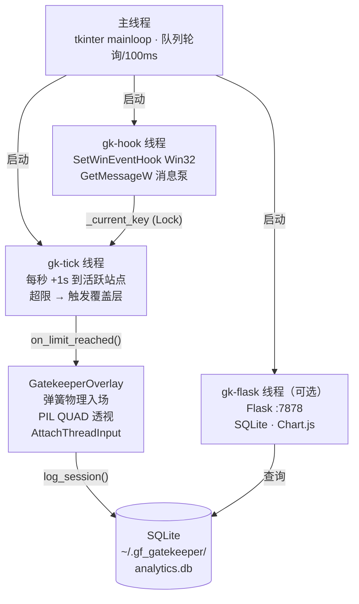

<div align="center">

# 💕 女友守护者 Girlfriend Gatekeeper

**刷社交媒体超时，自动全屏弹出女友照片。**

*没有什么比爱情更能打断无尽的刷屏。*

[English](README.md) | 中文说明

---

[](https://python.org)
[](https://github.com/Beltran12138/gf-gatekeeper-desktop)
[](LICENSE)
[](https://github.com/Beltran12138/gf-gatekeeper-desktop/stargazers)

</div>

---

## 演示


---

## 这是什么？

设置每个网站的时间上限（默认15分钟）。超时后：

1. **全屏覆盖层**以 3D 弹射入场动画出现
2. 播放女友照片 / GIF / 视频，配有脉冲光晕环和倒计时弧
3. **点击照片** → 微信自动切换到前台（`AttachThreadInput` 跨进程焦点切换）
4. 休息结束 → 覆盖层消失，计时重置

灵感来自 [catgatekeeper.org](https://www.catgatekeeper.org/)，适合动力来源比猫更私人的人。

---

## 功能特点

| 功能 | 实现方式 |
|------|---------|
| 🎯 **零开销监控** | `SetWinEventHook` Win32 事件 API，无轮询 |
| 📸 **多媒体支持** | 照片 / GIF / MP4 / AVI，圆形遮罩或微信视频通话样式 |
| 🌀 **3D 入场动画** | 弹簧阻尼物理（ω=10, ζ=0.6）+ PIL QUAD 透视变换 |
| 💬 **点击进入微信** | `AttachThreadInput` + `AllowSetForegroundWindow` 跨进程焦点 |
| 🎵 **音频** | pygame.mixer 背景音乐 + ffmpeg 视频音轨提取 |
| 📊 **统计面板** | 嵌入式 Flask + SQLite + Chart.js，实时 + 7 天历史 |
| 📦 **单文件 .exe** | PyInstaller 打包，用户无需安装 Python |
| ✅ **测试覆盖** | 14 个 pytest 用例，tracker 逻辑 + SQLite 层 |

---

## 快速开始

```bash
# 1. 克隆仓库
git clone https://github.com/Beltran12138/gf-gatekeeper-desktop
cd gf-gatekeeper-desktop

# 2. 安装依赖
pip install -r requirements.txt
pip install opencv-python  # 可选：视频（MP4/AVI）支持

# 3. 运行
python main.py
```

**初次设置（30秒）：**
1. 点击 **設置** → 上传女友照片 / GIF / 视频
2. 设置时间上限（默认 15 分钟 / 站点）
3. 最小化 → 监控立即开始
4. 点击 **面板** → 统计面板在 `http://localhost:7878`

> 要求：Windows 10/11 · Python 3.11+

---

## 技术亮点

### 事件驱动窗口追踪

用 `SetWinEventHook(EVENT_SYSTEM_FOREGROUND)` 替代轮询：每次前台窗口切换触发回调，待机 CPU 趋近于零。
同时在 tick 线程每秒轮询 `GetForegroundWindow` 捕获浏览器标签页切换（不触发窗口级事件）。

### 弹簧阻尼 3D 入场

欠阻尼弹簧（过冲约 8%，t≈0.8s 稳定）配合 PIL QUAD 透视变换，模拟"顶部朝向观察者"的 3D 弹出效果：

```
x(t) = 1 - e^(-ζωt) · [cos(ωd·t) + (ζω/ωd)·sin(ωd·t)]
ω=10，ζ=0.6，ωd≈8
```

### 跨进程窗口焦点

`SetForegroundWindow` 被 Windows 的焦点保护拦截时，通过 `AttachThreadInput` 附加线程输入队列绕过限制，实现点击照片即跳转微信。

---

## 架构



---

## 统计面板

访问 `http://localhost:7878`

- 本次 Session 实时数据（每 2 秒更新）
- 本周 Top 站点使用时长（分钟）
- 每日总时长趋势折线图

---

## 构建 .exe

```bash
pip install pyinstaller
pyinstaller build.spec
# → dist/GirlfriendGatekeeper.exe（单文件，用户无需 Python）
```

---

## 运行测试

```bash
pytest tests/ -v
# 14 个测试：tracker 逻辑 + SQLite 分析层
```

---

## 默认追踪站点

Instagram · TikTok · YouTube · Twitter/X · Reddit · Facebook · Threads · Bluesky · Weibo · 微博 · 抖音 · 小紅書 · Douyin · Bilibili

在 **設置 → 監測關鍵詞** 中添加自定义关键词。

---

## License

MIT © 2025

---

<div align="center">

</div>
